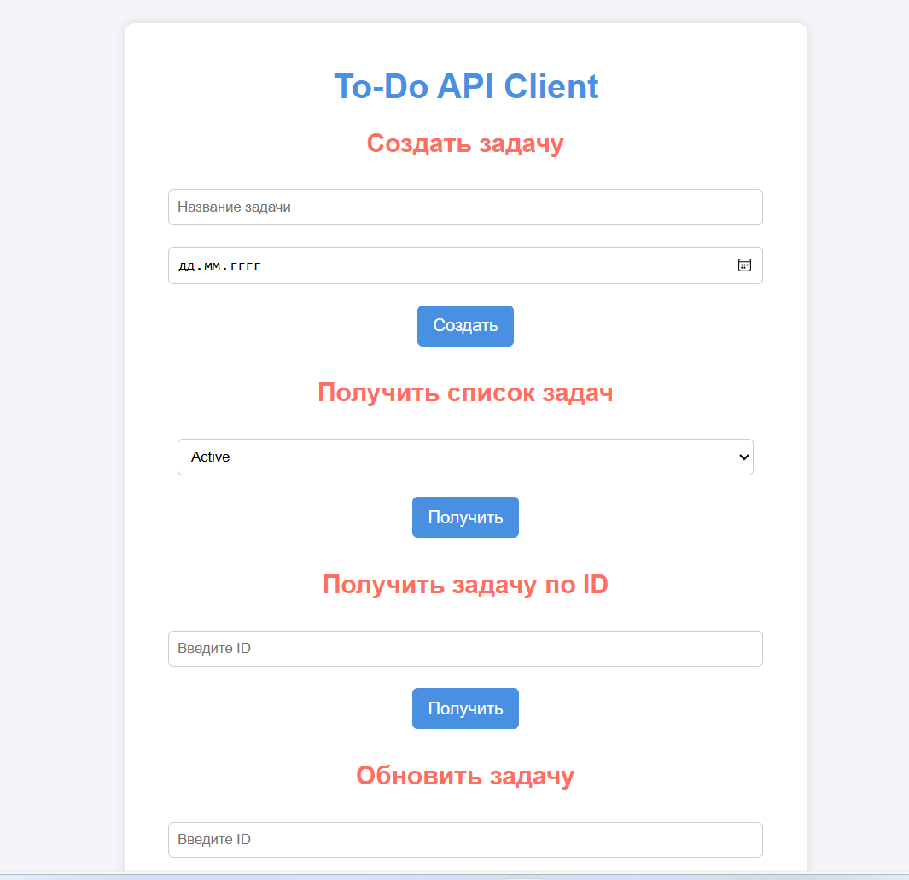

# Procrastin8

Procrastin8 - это микросервис для планирования досуга с полным CRUD-функционалом для работы с задачами.

Технологии которые были использованы:
  - Docker  (для запуска приложения)
  - MongoDB (noSQL база данных)
  - Golang (фреймворк gin)
  - Swagger (для документации API)

## Запуск через Docker

Сборка контейнера:
```sh
docker build -t my-go-app .
```

Запуск контейнера:
```sh
docker run -it -p 8080:8080 my-go-app
```

---

## Запуск через MakeFile

Сборка контейнера:
```sh
make up
```

Остановить контейнер:
```sh
make down
```

Логирование:
```sh
make logs
```


## Функционал

### 1) Создание новой задачи
**POST** `/api/todo-list/tasks`

#### Тело запроса:
```json
{
  "title": "Купить книгу",
  "activeAt": "2023-08-04"
}
```

#### Требования:
- Все поля обязательны.
- Заголовок не должен превышать 200 символов.
- Дата должна быть валидной.
- Проверка уникальности по `title` и `activeAt`.

#### Ответ:
- **201** + `id` задачи — если задача успешно создана.
- **404** — если задача уже существует.

---

### 2) Обновление задачи
**PUT** `/api/todo-list/tasks/{ID}`

#### Тело запроса:
```json
{
  "title": "Купить книгу - Высоконагруженные приложения",
  "activeAt": "2023-08-05"
}
```

#### Требования:
- `{ID}` обязателен.
- Все поля обязательны.
- Заголовок ≤ 200 символов.
- Дата должна быть валидной.

#### Ответ:
- **204** — если задача обновлена успешно.
- **404** — если задача не найдена.

---

### 3) Удаление задачи
**DELETE** `/api/todo-list/tasks/{ID}`

#### Требования:
- `{ID}` обязателен.

#### Ответ:
- **204** — если задача успешно удалена.
- **404** — если задача не найдена.

---

### 4) Пометка задачи выполненной
**PUT** `/api/todo-list/tasks/{ID}/done`

#### Требования:
- `{ID}` обязателен.
- Статус задачи изменяется на "выполнено".

#### Ответ:
- **204** — если задача успешно обновлена.
- **404** — если задача не найдена.

---

### 5) Получение списка задач по статусу
**GET** `/api/todo-list/tasks?status=active|done`

#### Правила:
- `status` необязателен, по умолчанию `active`.
- Если `status=active`, возвращаются все задачи, у которых `activeAt` ≤ текущего дня.
- Задачи сортируются по дате создания.
- Если день выходной (суббота/воскресенье), к заголовку добавляется префикс: `ВЫХОДНОЙ- {заголовок}`.

#### Ответ:
```json
[
  {
    "id": "65f19340848f4be025160391",
    "title": "Купить книгу - Высоконагруженные приложения",
    "activeAt": "2023-08-05"
  },
  {
    "id": "75f19340848f4be025160392",
    "title": "Купить квартиру :)",
    "activeAt": "2023-08-05"
  }
]
```

---

### 6) Удобный UI

Сделан минималистичный рендеринг сайта :)

Для этого достаточно подключиться через браузер на `http://localhost:8080/api/todo-list`


